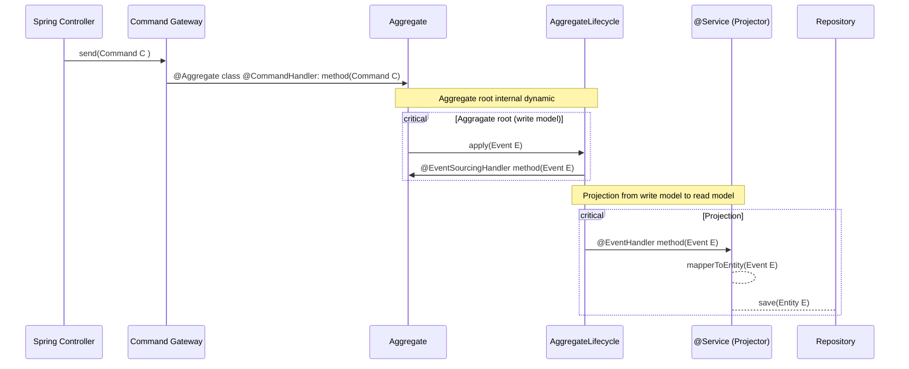
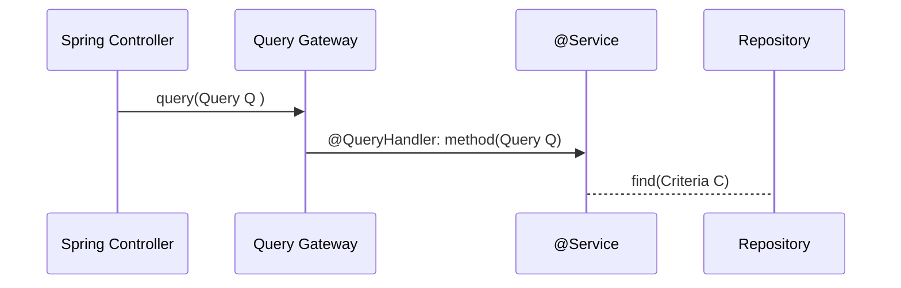

# CQRS y Event Sourcing con Axon Framework ( Parte 2) - Como hacer uso del Framework (Command/Event/Query)

# How to start

## Infrasctructure

1. Build the Docker containers:

   ```bash
   docker-compose pull
   ```

2. Start the Docker containers:

   ```bash
   docker-compose up -d
   ```

   The `-d` flag runs the containers in the background.

3. Access the Axon Server application at [http://localhost:8024/](http://localhost:8080) to finish the installation.

4. Finish Axon Server application startup

### Running locally:
Use any IDE to compile, run or run tests
Command line:
```bash
gradle bootJar
```

Run tests:
```bash
gradle test
```

### How to build a docker image
```bash
docker build . -t axon_basic
```

### OpenAPI Spec
There is an OPEN API specification for backend APIs  [giravolta-openapi_1.yaml](src/main/resources/giravolta-openapi_1.yaml)

```bash
cd src/main/resources
```


## Diagrams
Here are the details of how we implemented the solution represented in diagrams, for a better understanding

### Command processing



In this diagram, there is a sequence of events involving a system that includes a Spring Controller,
Command Gateway, Aggregate, AggregateLifecycle, and a @Service (Projector) with a Repository.

Here's a description of the diagram:

1. The Spring Controller sends a command (Command C) to the Command Gateway.
2. The Command Gateway receives the command and passes it to the Aggregate.
3. The Aggregate, which is an aggregate root representing the write model, performs internal dynamic operations.
4. Within the Aggregate, an event (Event E) is applied using AggregateLifecycle.
5. The Aggregate handles the event by invoking an @EventSourcingHandler method associated with that event.
6. AggregateLifecycle, along with the @Service (Projector), performs a projection from the write model to the read model.
7. The @Service (Projector) receives the event and executes an @EventHandler method specific to that event.
8. The @Service (Projector) uses a mapper to convert the event into an entity.
9. The @Service (Projector) saves the entity in a Repository.

Overall, this diagram represents a flow of commands and events within a system,
involving the handling of commands by the Aggregate and the projection of events by the @Service
(Projector) to update a read model.

### Query Processing



This diagram represents a sequence of events involving a Spring Controller, Query Gateway, @Service, and a Repository.

Here's a plain English description of the diagram:

1. The Spring Controller sends a query (Query Q) to the Query Gateway.
2. The Query Gateway receives the query and passes it to the @Service.
3. The @Service, which contains a @QueryHandler method, handles the query (Query Q).
4. The @Service interacts with a Repository to find data based on the provided criteria (Criteria C).

In summary, this diagram illustrates the flow of a query from a Spring Controller to a Query Gateway,which then delegates the query handling to a @Service.
The @Service interacts with a Repository to retrieve data based on the specified criteria.


