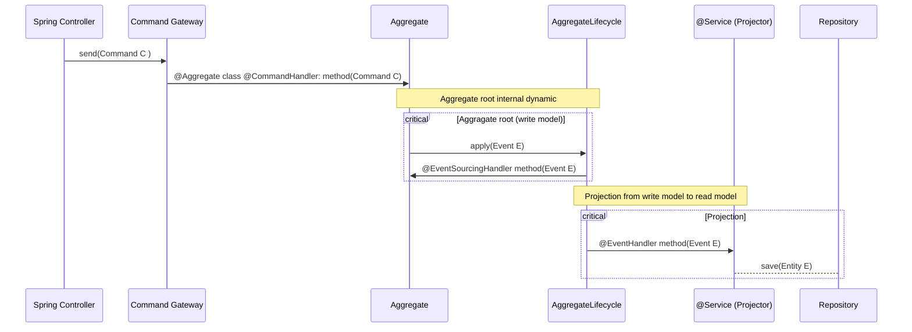
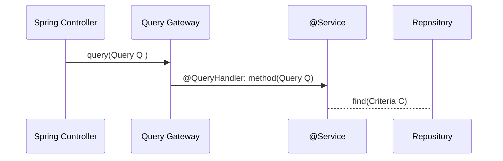

# CQRS and Event Sourcing with Axon Framework (Part 2) - How to use the Framework (Command/Event/Query)

# How to start

## Infrasctructure

1. Build the Docker containers:

   ```bash
   docker-compose pull
   ```

2. Start the Docker containers:

   ```bash
   docker-compose up -d
   ```

   The `-d` flag runs the containers in the background.

3. Access the Axon Server application at [http://localhost:8024/](http://localhost:8080) to finish the installation.

4. Finish Axon Server application startup

### Running locally:
Use any IDE to compile and run
Command line:
```bash
gradle bootJar
```

## Diagrams
Here are the details of how we implemented the solution represented in diagrams, for a better understanding

### Command processing


This sequence diagram outlines the flow of events in a typical CQRS (Command Query Responsibility Segregation) architecture with Event Sourcing. Let's break it down in plain English:

1. **Spring Controller:** This represents the part of your Spring application that handles incoming HTTP requests. In this case, it's initiating a command.

2. **Command Gateway:** The command is then sent to the Command Gateway. The Command Gateway is responsible for routing commands to the appropriate command handlers.

3. **Aggregate:** The command is received by an Aggregate. An Aggregate is a domain model that manages a specific consistency boundary within your application. It handles the command by invoking a method annotated with `@CommandHandler`.

   - Note: Aggregates typically encapsulate the business logic and are considered the write model in CQRS.

4. **Aggregate Lifecycle:** Inside the Aggregate, the command results in an internal dynamic process. This process involves applying an event using `AggregateLifecycle.apply(Event E)`. Applying an event means updating the state of the aggregate and recording the event.

5. **Aggregate @EventSourcingHandler:** After applying the event, the Aggregate invokes a method annotated with `@EventSourcingHandler`. This method updates the aggregate's state based on the applied event.

6. **Projection (Read Model):** Simultaneously, the event is projected to a read model. This typically involves updating a separate read-optimized data store (e.g., a database) to provide efficient querying for read operations.

   - Note: Projections are often implemented using projectors, which are services that listen for events and update the read model accordingly.

7. **@Service (Projector) @EventHandler:** The event is received by a service (projector) annotated with `@EventHandler`. This service is responsible for handling the event and updating the read model.

8. **Repository:** Finally, the updated read model is saved to a repository. This repository might be a database or another storage mechanism.

   - Note: The read model is typically used to serve queries and provide a denormalized view of the data optimized for reading.

In summary, this diagram illustrates the flow of commands, events, and the separation of the write and read models in a CQRS architecture with Event Sourcing. Commands are handled by Aggregates in the write model, and events are used to update both the Aggregate's state and the read model for efficient querying.

### Query Processing


The sequence diagram illustrates a sequence of interactions in a Spring-based application using the Axon Framework. Let's break it down step by step:

1. **Spring Controller Initiates a Query:**
   - The process starts with a Spring Controller initiating a query. In the diagram, this is represented by the arrow labeled "Spring Controller->>Query Gateway: query(Query Q)."
   - The Spring Controller sends a query (represented by `Query Q`) to the Query Gateway.

2. **Query Gateway Handling the Query:**
   - The Query Gateway receives the query (`Query Q`) from the Spring Controller. The arrow labeled "Query Gateway->> @Service: @QueryHandler: method(Query Q)" indicates this transition.
   - The Query Gateway then delegates the query to a service class (annotated with `@Service`) using a method annotated with `@QueryHandler`.

3. **Service Class Handling the Query:**
   - The `@Service` class, which is responsible for handling the query, receives the query (`Query Q`). The arrow labeled "@Service --> Repository: find(Criteria C)" indicates the next step.
   - Inside the service class, a method annotated with `@QueryHandler` processes the query. This method might include business logic or further delegation.

4. **Repository Interaction:**
   - The `@Service` class interacts with a repository (likely a database repository) to retrieve data based on the query's criteria. The arrow labeled "Service --> Repository: find(Criteria C)" illustrates this interaction.
   - The repository's `find` method is called with criteria (`Criteria C`) to retrieve the relevant data.

In plain English, this diagram describes the flow of a query operation in a Spring-based application. 
The Spring Controller initiates a query, which is then handled by the Query Gateway. 
The Query Gateway delegates the query to a service class annotated with `@Service`. 
This service class, in turn, interacts with a repository to fetch data based on the query's criteria. 
The entire process represents a common flow in handling queries in a CQRS (Command Query Responsibility Segregation) architecture using Axon Framework in a Spring application.

## Testing

### Order
The OrderController class handles HTTP requests related to orders.
It provides endpoints for creating orders, canceling orders, and retrieving orders.

To try out how the application works, here are some curls for each scenario:

To create a Order:

```bash
curl -X POST --location "http://localhost:8080/api/v1/order/" \
    -H "Content-Type: application/json" \
    -d '{
            "customerId": "7487da5c-dc60-48c1-b2ae-9a89db69e1b1",
            "orderItems": [
              {
                "productId": "0005ab06-8c78-433d-9349-5046c3aa7265",
                "productName": "Product 1",
                "price": 10.0,
                "quantity": 3
              },
              {
                "productId": "ba66b2d6-c8a6-4ced-b5dc-d08c7aec0e53",
                "productName": "Product 2",
                "price": 15.0,
                "quantity":3
              }
            ],
            "street": "123 Main St",
            "city": "New York",
            "state": "NY",
            "zipCode": "10001"
          }'
```


```bash
curl -X GET --location "http://localhost:8080/api/v1/order/{{orderId}}"
```

```bash
curl -X GET --location "http://localhost:8080/api/v1/order/"
```

```bash
curl -X DELETE --location "http://localhost:8080/api/v1/order/{{orderId}}"
```

### Product
The ProductController class is a REST controller that handles HTTP requests related to products. 
It has methods to add a product to an order and remove a product from an order.

```bash
curl -X PUT --location "http://localhost:8080/api/v1/product//{{orderId}}/product" \
    -H "Content-Type: application/json" \
    -d '{
          "productId": "c15de833-4e4f-4afb-a1a8-89b406578ae0",
          "productName": "Product3",
          "price": 17,
          "quantity": 8
        }'
```

```bash
curl -X GET --location "http://localhost:8080/api/v1/product//{{orderId}}/product"
```

```bash
curl -X DELETE --location "http://localhost:8080/api/v1/product//{{orderId}}/product//{{productId}}"
```
